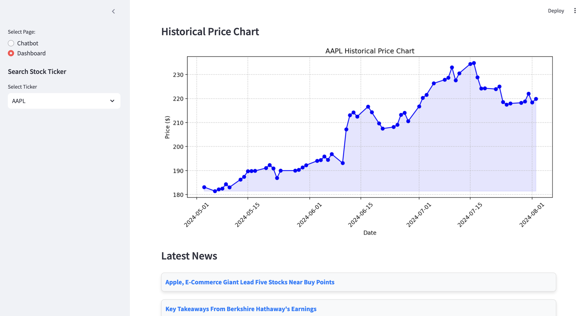

# Fin4All

## Inspiration
Investing has traditionally been dominated by those with access to advanced tools, resources, and knowledge. However, with the rise of technology, we believe that everyone, regardless of their experience level, should have equal access to these opportunities. The idea behind Fin4All was born from the desire to democratize investing by providing a platform that offers comprehensive support, actionable insights, and cutting-edge technology to all investors, whether they're just starting or are seasoned professionals. We wanted to create a tool that levels the playing field, making investing more accessible, understandable, and equitable for everyone.

Additionally, we recognize that Reddit is one of the largest social media platforms where people actively discuss financial markets and investments. Exploring discussions and sentiment on Reddit offers a valuable opportunity to gain insights into public opinion and emerging trends. By analyzing these discussions, we can provide users with a more nuanced understanding of what people are talking about and how it may impact investment decisions.

## What it does
Fin4All is an all-in-one investment assistant designed to empower users with varying levels of experience. The platform provides real-time stock analysis, sentiment-driven insights, and personalized investment recommendations. By leveraging AI-driven sentiment analysis and integrating up-to-date financial data, Fin4All offers users the ability to make informed investment decisions. Whether you have a specific stock in mind or need guidance on potential investment opportunities, Fin4All provides tailored advice, ensuring that every user has the tools and information they need to succeed in the market.

## How we built it
We built Fin4All using a combination of cutting-edge technologies and robust financial data sources. The backend is powered by Django, handling data processing, storage, and API interactions. We integrated OpenAI's GPT models for natural language processing and sentiment analysis, allowing us to generate insightful summaries and recommendations. Streamlit was used for the frontend, providing a clean and interactive user interface. Data from sources like Finnhub and Yahoo Finance is continuously fed into the system, ensuring that users always have the latest market information at their fingertips.

## Challenges we ran into
One of the significant challenges we faced was managing and processing large volumes of financial data while staying within token limits for AI models. Ensuring that the platform could deliver real-time insights without compromising on accuracy or speed required extensive optimization. Another challenge was integrating multiple data sources and ensuring consistency across various modules of the platform. Balancing the user interface to be both comprehensive and user-friendly for investors of all experience levels was also a complex task that required thoughtful design and iteration.

## Accomplishments that we're proud of
We’re incredibly proud of creating a platform that truly democratizes access to investment tools and insights. The seamless integration of AI-driven analysis with real-time financial data is a significant achievement, allowing us to deliver actionable insights to users in a matter of seconds. We also take pride in the user experience we've crafted, making a sophisticated tool accessible and easy to use for all types of investors. Successfully building a solution that bridges the gap between novice and expert investors feels like a meaningful step toward our goal of financial inclusivity.

Meanwhile, by combining ticker-specific information with public discussions from platforms like Reddit, we provide a more robust analysis. This approach not only enhances the depth of our insights but also bridges the gap between traditional financial analysis and social sentiment, offering a comprehensive view that benefits both novice and expert investors.

## What we learned
Throughout the development of Fin4All, we gained valuable insights into the complexities of financial markets and the importance of user-centric design. We learned how to effectively harness AI to generate meaningful insights and the importance of optimizing data processing pipelines for real-time applications. Additionally, this project taught us the significance of iterative design, where user feedback was crucial in refining the platform’s features and user interface.

## What's next for Fin4All
The journey for Fin4All doesn’t end here. Moving forward, we plan to expand the platform’s capabilities by incorporating more advanced predictive analytics and machine learning models to offer even more personalized investment advice. We’re also exploring partnerships with financial institutions to integrate additional resources and tools for our users.

Our goal is to continue enhancing the platform, making it an indispensable tool for anyone looking to invest wisely, regardless of their experience level. In addition to stocks, we are looking to broaden the scope of investment options by incorporating other asset classes, such as cryptocurrencies, bonds, and emerging technologies like blockchain. By doing so, we aim to provide our users with a comprehensive view of various investment opportunities, allowing them to diversify and optimize their portfolios effectively.
